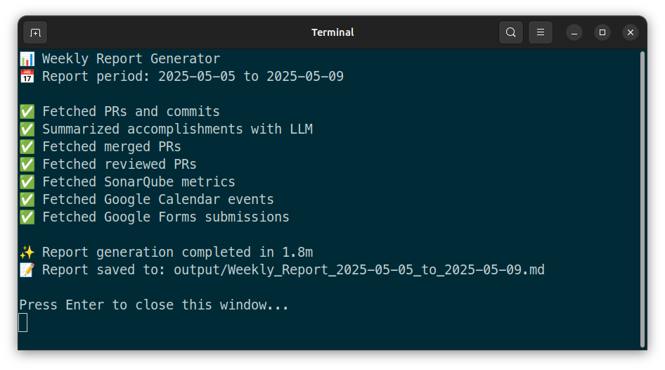

# 📝 GDP Labs Weekly Report Generator

A Python-based tool that automatically generates comprehensive weekly reports by integrating data from multiple services including GitHub, SonarQube, Google Calendar, and Google Forms. The generated reports are enhanced with AI-powered summaries using the Groq API and DeepSeek's reasoning R1 model. Reports can be generated locally in Markdown format and synchronized with Google Docs for easier sharing and collaboration.



## Features

- **Multi-Service Integration:**
  - **GitHub**: Track PRs, commits, and code reviews
  - **SonarQube**: Monitor test coverage metrics
  - **Google Calendar**: Log meetings and activities
  - **Google Forms**: Track form submissions
  - **Groq & Gemini AI**: Generate intelligent PR summaries

- **Smart Report Generation:**
  - Automatic weekly date range detection
  - Customizable report templates
  - Progress tracking during generation
  - Markdown output format

- **Flexible Configuration:**
  - Environment-based setup
  - Service-specific toggles
  - Customizable templates
  - Multiple repository support

- **Google Docs Synchronization:**
  - Automatic detection of linked Google Docs
  - Seamless push of report content to Google Docs
  - Gmail integration for finding report links
  - Maintain consistent reports across platforms

## Quick Start

1. Clone this repository

2. Run the setup script (1-line installation):
```bash
chmod +x setup.sh && ./setup.sh
```
or right-click on the file and select `Run as a Program` (Ubuntu)

3. Configure your environment variables

4. Configure your user data in [`user_data.py`](https://github.com/luvnyen/gdp-labs-weekly-report-generator/blob/main/core/user_data.py):
   - Set your WFO (Work From Office) and Out of Office days using numbers 1-5 for Monday to Friday
   - Update your learning activities with relevant URLs and progress
   - Add any ongoing issues or bugs you're tracking
   - Update metrics such as major/minor bugs found this month or within the last six months
   - Customize your next steps

5. Customize your report structure in [template/](https://github.com/luvnyen/gdp-labs-weekly-report-generator/tree/main/templates)template.md:
   - Add or remove sections as needed
   - Adjust formatting and styling
   - Use template variables defined in [`weekly_report_generator.py`](https://github.com/luvnyen/gdp-labs-weekly-report-generator/blob/main/core/weekly_report_generator.py) such as `{issues}`, `{accomplishments}`, `{deployments}`, etc.

6. Generate a report:
```bash
./run.sh
```

7. Review and make changes if necessary to the generated weekly report in the `output` directory

8. Sync with Google Docs:
```bash
./sync_to_gdocs.sh
```

## Customizing the LLM Prompt

If you want to modify the prompt for Large Language Model (LLM) summarization (such as the format, instructions, or summary details), you can directly edit the prompt configuration in the [`llm_service.py`](https://github.com/luvnyen/gdp-labs-weekly-report-generator/blob/main/core/services/llm_service.py) file.
- Look for the `SYSTEM_PROMPT` and `USER_PROMPT` variables within the file.
- Adjust the content of these variables to fit your desired summarization style or formatting.

After saving your changes, the new prompt will be used for all future AI-powered report summaries.

## Environment Variables

The application uses various service tokens and configurations stored in a `.env` file. Here's how to obtain each required token:

### GitHub Personal Access Token Configuration

 - Generate at [GitHub Token Settings](https://github.com/settings/tokens/new)
  - Required scopes: `repo` (we only need `repo:status`)
  - Set expiration as needed (can be set to no expiration)

### SonarQube User Token Configuration

  - Generate at [SonarQube Security Settings](https://sqa.gdplabs.net/account/security)
  - Type: `User Token`
  - Set expiration as needed (can be set to no expiration)

### Google Client Secret File Configuration

> [!IMPORTANT]  
> Use personal `@gmail.com` account

#### Google Auth Project Configuration

1. Go to [Google Cloud Console](https://console.cloud.google.com/projectcreate) to create a new project:
   * Set the `Project name` (e.g., `Weekly Report Generator`)
   * Set the `Location` as `No organization`
2. Wait for project creation to complete, then select your project
3. Navigate to [Google Auth Platform](https://console.cloud.google.com/auth/overview) and click `GET STARTED`
4. Complete the required sections:
   * **App Information**:
     * Enter `App name` (e.g., `Weekly Report Generator`)
     * Enter your personal email as `User support email`
   * **Audience**: Select `External`
   * **Contact Information**: Enter your personal email
5. Read and accept the `Google API Services: User Data Policy`
6. Click `CREATE` to finish setup
7. Navigate to the [OAuth consent screen](https://console.cloud.google.com/apis/credentials/consent) and scroll down to the `Test users` section
8. Click `+ ADD USERS` to register your `@gdplabs.id` email address as a test user, then click `SAVE`
   
#### Create Google OAuth Client ID

1. Navigate to the [Create OAuth client ID](https://console.cloud.google.com/apis/credentials/oauthclient) page
2. Configure the OAuth client:
   * Set `Application type` to `Desktop app`
   * Enter a `Name` (e.g., `Weekly Report Generator`)
3. Click `CREATE` to generate the client ID
4. Download the Google OAuth client secret JSON file
5. Place the downloaded file in your project's root directory
6. Update the `GOOGLE_CLIENT_SECRET_FILE` variable in your `.env` file with the path to the client secret file
      
#### Enable Google API Services

1. Enable the required Google APIs:
   * [Gmail API](https://console.cloud.google.com/apis/library/gmail.googleapis.com)
   * [Google Calendar API](https://console.cloud.google.com/apis/library/calendar-json.googleapis.com)
   * [Google Docs API](https://console.cloud.google.com/apis/library/docs.googleapis.com)

### Gemini API Key Configuration

  > [!IMPORTANT]  
  > Use personal `@gmail.com` account

  - Generate at [Google AI Studio](https://aistudio.google.com/app/apikey) (don't worry, it's free!)

### Groq API Key Configuration

  - Generate at [GroqCloud](https://console.groq.com/keys) (don't worry, it's free!)

## Google Docs Synchronization

The weekly report generator supports synchronization with Google Docs, allowing you to push your generated Markdown reports directly to a connected Google Docs document for easier sharing and collaboration.

### How It Works

1. The system finds your latest generated weekly report Markdown file in the `output` directory
2. It searches your Gmail for this week's email reminder to fill the weekly report
3. It extracts the Google Docs document ID from the link
4. It pushes the Markdown content to the Google Docs document, replacing any existing content

### Usage

To synchronize your latest weekly report with Google Docs:

```bash
./sync_to_google_docs.sh
```

### Known Limitations

> [!IMPORTANT]  
> Do not modify the heading structure (only for heading 1 [#] and 2 [##])
> in your template or in Google Docs as stated by the Weekly Report Agent team.

Currently, the Google Docs API doesn't support direct markdown-to-rich-text conversion.
All content is inserted as plain text, which means:

- Formatting like bold, italics, and links will appear as Markdown syntax
- Headings will show with their # characters rather than actual heading styles
- Tables will appear in their Markdown format rather than as actual Google Docs tables

Future versions may implement automatic conversion between Markdown syntax and Google Docs formatting elements.

### Converting Markdown to Formatted Text

Before converting your Markdown to properly format text in Google Docs, ensure that the Markdown option is enabled:

1. In Google Docs, navigate to **Tools** > **Preferences**.
2. Check the option to **Enable Markdown**.
3. Click **OK** to save your changes.

After enabling Markdown, follow these steps to convert your plain Markdown to formatted text:

1. In Google Docs, press **Ctrl + A** to select all content
2. Press **Ctrl + X** to cut the content
3. Right-click on the empty document area and select **Paste as Markdown**

## Report Structure

Generated reports include:
- **Issues**: Track ongoing challenges or blockers
- **Metrics**: Bug counts, code quality measurements, and other key performance indicators
- **Test Coverage**: Statistics from SonarQube Analysis (SQA) for monitored components
- **Accomplishments**: AI-generated summaries of your PRs and contributions
- **Deployments**: Information about merged PRs and releases
- **PR Reviews**: Code review activities you've conducted
- **Google Forms**: Forms submitted during the week
- **Meetings and Events**: Calendar activities including meetings, trainings, and conferences
- **Work From Office (WFO)**: Days you worked from the office during the week
- **Next Steps**: Upcoming focus areas and tasks
- **Learning**: Technology, business, leadership, and other learning activities
- **Out of Office**: Planned leave or other absences

<details>
<summary>👈 Click here to see an example of a generated weekly report</summary>

> # [Weekly Report: Calvert Tanudihardjo] 04 May 2025 - 10 May 2025
> 
> ## **Issues**
> 
> * None
> 
> ## **Accomplishments**
> 
> ### **CATAPA**
> 
> * feat(api-gateway): map `/core/v1/employees/*/termination-entries` with `READ_TERMINATED_EMPLOYEE` [CATAPA-API#19971](https://github.com/GDP-ADMIN/CATAPA-API/pull/19971)
>     * **Description:** Mapped the API gateway endpoint `/core/v1/employees/*/termination-entries` to the `READ_TERMINATED_EMPLOYEE` permission.
>     * **Status:** In Review
>     * **Key Changes Implemented:**
>         * Mapped the API gateway endpoint `/core/v1/employees/*/termination-entries` with the `READ_TERMINATED_EMPLOYEE` permission.
> 
> * [#5701-1] fix(core): correct `employment_status_histories` end dates beyond termination dates via DML [CATAPA-API#19924](https://github.com/GDP-ADMIN/CATAPA-API/pull/19924)
>     * **Description:** Corrected `employment_status_histories` end dates relative to termination dates via DML, refactored related business logic, enhanced validation, and consolidated service classes for improved data consistency and maintainability.
>     * **Status:** Done
>     * **Key Changes Implemented:**
>         * Updated `employment_status_histories` table to set `end_date` to termination's `effective_date` for records with later or `NULL` end dates.
> 
> * [#5701-2] refactor(core): improve employment status and termination integration logic [CATAPA-API#19941](https://github.com/GDP-ADMIN/CATAPA-API/pull/19941)
>     * **Description:** Refactored core logic to enhance integration between employment status and termination processes, including DML corrections for end dates, centralized validation, service class consolidation, and improved documentation.
>     * **Status:** Done
>     * **Key Changes Implemented:**
>         * Updated `EmploymentStatusApprovalService` to delegate employment status validation concerning termination to `AssignmentValidatorService`.
>         * Modified `EmploymentStatusHistoryServiceImpl` (later `EmploymentStatusHistoryService`) to set end dates based on approved termination data in `create()`, `create(employmentStatusApproval)`, and `update()` methods, simplifying `Optional` handling.
>         * Added `findApprovedByEmployeeId` method in `TerminationEntryService`.
>         * Renamed `validateAssignmentWithoutTerminationDateCheck` to `validateAssignmentCore` and subsequently consolidated its logic into a private `validateAssignmentRelationships` method within `AssignmentValidatorService`.
>         * Added validation in `TerminationEntryValidatorImpl` to check for upcoming employment statuses prior to termination approval.
>         * Enhanced `setEndDateInEmploymentStatusHistory` method to correctly identify the latest relevant employment status history.
>         * Added integration tests for `getEndDateBasedOnTermination` method covering various date scenarios.
>         * Added and improved Javadoc for `AssignmentValidatorService` methods and `EmploymentStatusHistoryService#getEndDateBasedOnTermination`.
> 
> * [#5701-3] chore(core): remove `EmploymentStatusHistoryService` interface class [CATAPA-API#19943](https://github.com/GDP-ADMIN/CATAPA-API/pull/19943)
>     * **Description:** This chore removed the `EmploymentStatusHistoryService` interface and consolidated its implementation `EmploymentStatusHistoryServiceImpl` into `EmploymentStatusHistoryService`.
>     * **Status:** Done
>     * **Key Changes Implemented:**
>         * Removed the `EmploymentStatusHistoryService` interface class.
>         * Renamed `EmploymentStatusHistoryServiceImpl` to `EmploymentStatusHistoryService`.
>         * Removed `@Override` annotations from methods in the former `EmploymentStatusHistoryServiceImpl` due to the interface's removal.
>         * Updated all references from `EmploymentStatusHistoryServiceImpl` (and the former interface) to the new `EmploymentStatusHistoryService` class name in service, test, and other related classes.
> 
> #### **Deployment Released (Production and BCA Digital):**
> 
>   * [#5701-1] fix(core): correct `employment_status_histories` end dates beyond termination dates via DML [CATAPA-API#19924](https://github.com/GDP-ADMIN/CATAPA-API/pull/19924)
>   * [#5701-2] refactor(core): improve employment status and termination integration logic [CATAPA-API#19941](https://github.com/GDP-ADMIN/CATAPA-API/pull/19941)
>   * [#5701-3] chore(core): remove `EmploymentStatusHistoryService` interface class [CATAPA-API#19943](https://github.com/GDP-ADMIN/CATAPA-API/pull/19943)
> 
> #### **PR(s) Reviewed:**
> 
>   * New Public API for GET Historical Education [CATAPA-API#19887](https://github.com/GDP-ADMIN/CATAPA-API/pull/19887)
>   * feat(api-gateway): update chart related authority in role authority [CATAPA-API#19970](https://github.com/GDP-ADMIN/CATAPA-API/pull/19970)
>   * Support Sub Location Event Listener for Djarum Extension [Release 13May25] [CATAPA-API#19925](https://github.com/GDP-ADMIN/CATAPA-API/pull/19925)
>   * [#4520-1] feat(core): add endpoint without data trustee [Release 9 May 25] [CATAPA-API#19845](https://github.com/GDP-ADMIN/CATAPA-API/pull/19845)
>   * [#4520-3] feat(core): add data trustee in dropdown endpoint [Release 9 May 2025] [CATAPA-API#19848](https://github.com/GDP-ADMIN/CATAPA-API/pull/19848)
>   * [#5605] update employment type employment group code column and validation [CATAPA-API#19935](https://github.com/GDP-ADMIN/CATAPA-API/pull/19935)
>   * #4859-kw1 [BE] Create Flyway Migration to Add All Master Data Code Columns and State Description [Release 9May25] [CATAPA-API#19832](https://github.com/GDP-ADMIN/CATAPA-API/pull/19832)
>   * #4859-kw2d [BE] Implement Institution Code [Release 9May25] [CATAPA-API#19858](https://github.com/GDP-ADMIN/CATAPA-API/pull/19858)
> 
> #### **Google Form(s) Filled:**
> 
>   * Feedback Form for GLoria (submitted on Monday, May 5th, 2025 at 11:42 AM)
>   * Feedback Form for AI Agents (submitted on Monday, May 5th, 2025 at 7:53 AM)
> 
> ### **Others**
> 
> * feat: implement Google Docs sync [gdp-labs-weekly-report-generator@de137c1](https://github.com/luvnyen/gdp-labs-weekly-report-generator/commit/de137c12c6c9acbaddf8a0e5d9662846e77e7301)
>     * **Description:** Added an end-to-end workflow to sync weekly reports to Google Docs.  
>     * **Status:** Done
>     * **Key Changes Implemented:**  
>         * Added `sync_to_google_docs.sh` for automated synchronization.  
>         * Created `sync_to_google_docs.py` to perform the syncing via Gmail.  
>         * Introduced `GOOGLE_DOCS_SCOPES` in `config.py` for Docs API access.  
>         * Added `update_google_docs_content` and `extract_google_docs_id_from_url` in `google_docs_service.py`.  
>         * Enhanced `user_data.py` with `OUT_OF_OFFICE_DAYS` to track absences.  
>         * Updated report templates to include sync info and out-of-office details.  
>         * Documented Google Docs synchronization in `README.md`.
> 
> #### **PR(s) Reviewed:**
> 
>   * Adjust setup to support mac [gdp-labs-weekly-report-generator#5](https://github.com/luvnyen/gdp-labs-weekly-report-generator/pull/5)
>   * [Enhancement] Add `omtm` and `self_accomplishment` to template [gdp-labs-weekly-report-generator#9](https://github.com/luvnyen/gdp-labs-weekly-report-generator/pull/9)
> 
> ## **Meetings/Events/Training/Conferences**
> 
>   * **Monday, May 5th, 2025**
>     * 8:00 AM – 9:00 AM: ECHO - Sprint Planning📝
>     * 9:00 AM – 9:45 AM: CATAPA Sync
>     * 10:00 AM – 10:30 AM: Calvert / David Regular 1:1
>     * 11:15 AM – 12:15 PM: CEO & Engineers Town Hall
>   * **Tuesday, May 6th, 2025**
>     * 11:00 AM – 12:00 PM: ECHO - Daily Sync
>   * **Wednesday, May 7th, 2025**
>     * 11:00 AM – 12:00 PM: ECHO - Daily Sync
>   * **Thursday, May 8th, 2025**
>     * 11:00 AM – 12:00 PM: ECHO - Daily Sync
>     * 1:30 PM – 2:30 PM: CATAPA BE Weekly Meeting
>   * **Friday, May 9th, 2025**
>     * 11:00 AM – 12:00 PM: ECHO - Daily Sync
> 
> #### **Worked from Surabaya Office (WFO) on:**
> 
>   * Monday, May 5th, 2025
>   * Tuesday, May 6th, 2025
>   * Wednesday, May 7th, 2025
> 
> ## **Key Metrics / OMTM**
> 
> #### **Reported Bug(s) (May 2025)**
> 
> * Major: 0
> * Minor: 0
> 
> #### **Total Reported Bug(s) (H1 2025)**
> 
> * Major: 0
> * Minor: 1
> 
> #### **Test Coverage**
> 
> * catapa-core
>   * personnel: [96.7%](https://sqa.gdplabs.net/code?id=catapa-core&selected=catapa-core:src/main/java/com/catapa/core/personnel) (target: 97%)
> 
> ## **Next Actions**
> 
> * Refactor termination entry service for extension needs
> * Review installed extensions PR
> 
> ## **Technology, Business, Communication, Leadership, Management & Marketing**
> 
> * [O'Reilly Media] [Clean Architecture: A Craftsman's Guide to Software Structure and Design](https://www.oreilly.com/library/view/clean-architecture-a/9780134494272/) by Robert C. Martin (Chapter 30/34)
> * [YouTube] [What is MCP? Integrate AI Agents with Databases & APIs](https://youtu.be/eur8dUO9mvE?si=W2r1u5b0PA-Dnjik)
> * [YouTube] [Build Anything With a CUSTOM MCP Server - Python Tutorial](https://youtu.be/-8k9lGpGQ6g?si=c8l5AFtgtIExZ6r6)
> 
> ## **Out of Office**
> 
>   * None
> 
> <p style="font-size: 0.8em; color: #888; font-style: italic;">
>     All times are in UTC+07:00.<br>
>     This weekly report is generated using GitHub, Google, and SonarQube APIs.<br>
>     Accomplishments are summarized using the Gemini 2.5 Pro LLM API.<br>
>     <br>
>     Tired of manual weekly reports? Let AI turn your GitHub activity, meetings, and metrics into perfectly structured weekly reports—effortlessly! <a href="https://github.com/luvnyen/gdp-labs-weekly-report-generator">Try it now</a>
> </p>

</details>

## Development

### Project Structure
```
weekly-report-generator/
├── core/
│   ├── services/
│   │   ├── github_service.py
│   │   ├── llm_service.py
│   │   ├── google_service.py
│   │   └── ...
│   └── weekly_report_generator.py
├── templates/
│   └── template.md
├── config/
│   └── config.py
├── utils/
│   └── ...
├── main.py
├── setup.sh
└── run.sh
```

### Adding New Features

1. Service Integration:
   - Add new service configuration in [`config/config.py`](https://github.com/luvnyen/gdp-labs-weekly-report-generator/blob/main/config/config.py)
   - Create service module in [`core/services`](https://github.com/luvnyen/gdp-labs-weekly-report-generator/tree/main/core/services)
   - Update [`weekly_report_generator.py`](https://github.com/luvnyen/gdp-labs-weekly-report-generator/blob/main/core/weekly_report_generator.py) to include new data

2. Template Customization:
   - Modify `templates/template.md`
   - Update placeholders in the template
   - Adjust formatting as needed

3. **Adding Dependencies:**
   - If your new feature introduces external dependencies, add them to `requirements.txt`
   - Inform users/contributors to run `pip install -r requirements.txt` after updating dependencies

## Pro Tips

### Generate Semantic Commit Messages with AI

You can use AI to generate well-formatted semantic commit messages for your contributions. Here's how:

1. Copy your diff to clipboard by running:

   For Linux:
   ```bash
   git diff | xclip -selection clipboard
   ```
   
   For macOS:
   ```bash
   git diff | pbcopy
   ```

   Or for a specific commit:
   
   For Linux:
   ```bash
   git show <commit_sha> | xclip -selection clipboard
   ```
   
   For macOS:
   ```bash
   git show <commit_sha> | pbcopy
   ```

2. Paste the diff into [GLoria (GL Chat)](https://chat.gdplabs.id/) with this example prompt:

   ```
   Generate a semantic commit message with a description based on the changes. Look at the module to be included (if any) in the semantic commit message from the file directory (e.g. core, common, api-gateway, etc.). Format code-related words with backticks. The example output should be like this:
   
   refactor(api-gateway): revert endpoint name from widgets to installed
   
   - Changed API endpoint from `/widgets` back to `/installed`
   - Renamed `ExtensionWidgetResponse` to `ExtensionInstalledResponse`
   - Made `ExtensionInstalledDetails` extend `ExtensionViewableResponse`
   - Updated tests to use new endpoint name
   - Reverted changes in public and ignored endpoints config
   ```

This ensures your commit history is clean and consistent.
Better commit messages also improve the AI-generated summaries in your weekly reports,
clarifying your accomplishments to your team and managers.

## Contributing

Contributions are welcome! Please feel free to submit pull requests.

### Contributors

- Calvert Tanudihardjo ([calvert.tanudihardjo@gdplabs.id](mailto:calvert.tanudihardjo@gdplabs.id))
- Glenn Steven Santoso ([glenn.s.santoso@gdplabs.id](mailto:glenn.s.santoso@gdplabs.id))
- Sandy Akbar Dewangga ([sandy.a.dewangga@gdplabs.id](mailto:sandy.a.dewangga@gdplabs.id))