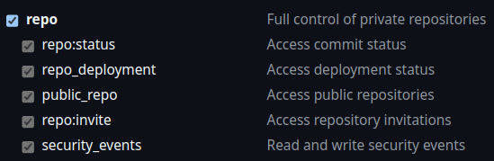

# 📝 GDP Labs Weekly Report Generator

A Python-based tool that automatically generates comprehensive weekly reports by integrating data from multiple services including GitHub, SonarQube, Google Calendar, Google Forms, and Gmail. The generated reports are enhanced with AI-powered summaries using Google's Gemini model.

## Features

- **Multi-Service Integration:**
  - **GitHub**: Track PRs, commits, and code reviews
  - **SonarQube**: Monitor test coverage metrics
  - **Google Calendar**: Log meetings and activities
  - **Google Forms**: Track form submissions
  - **Gmail**: Auto-create formatted email drafts
  - **Gemini AI**: Generate intelligent PR summaries

- **Smart Report Generation:**
  - Automatic weekly date range detection
  - Customizable report templates
  - Progress tracking during generation
  - Markdown output format
  - HTML email drafts with styling

- **Flexible Configuration:**
  - Environment-based setup
  - Service-specific toggles
  - Customizable templates
  - Multiple repository support

## Quick Start

1. Clone this repository

2. Run the setup script:
```bash
chmod +x setup.sh
./setup.sh
```
or right-click on the file and select `Run as a Program` (Ubuntu)

3. Configure your environment variables

4. Configure your user data in [`user_data.py`](https://github.com/luvnyen/gdp-labs-weekly-report-generator/blob/main/core/user_data.py):
   - Set your WFO (Work From Office) days using numbers 1-5 for Monday to Friday
   - Update your learning activities with relevant URLs and progress
   - Add any ongoing issues or bugs you're tracking
   - Customize your next steps
   - Modify the Gmail template if needed

5. Customize your report structure in [template/](https://github.com/luvnyen/gdp-labs-weekly-report-generator/tree/main/templates)template.md:
   - Add or remove sections as needed
   - Adjust formatting and styling
   - Use template variables defined in [`weekly_report_generator.py`](https://github.com/luvnyen/gdp-labs-weekly-report-generator/blob/main/core/weekly_report_generator.py) such as `{issues}`, `{accomplishments}`, `{deployments}`, etc.

6. Generate a report:
```bash
./run.sh
```

## Environment Variables

The application uses various service tokens and configurations stored in a `.env` file. Here's how to obtain each required token:

### GitHub Personal Access Token Configuration

 - Generate at [GitHub Token Settings](https://github.com/settings/tokens/new)
  - Required scopes: `repo` (full repository access)<br>
    
  - Set expiration as needed (can be set to no expiration)

### SonarQube User Token Configuration

  - Generate at [SonarQube Security Settings](https://sqa.gdplabs.net/account/security)
  - Type: `User Token`
  - Set expiration as needed (can be set to no expiration)

### Google Client Secret File Configuration

> [!IMPORTANT]  
> Use personal `@gmail.com` account

#### Google Auth Project Configuration

1. Go to [Google Cloud Console](https://console.cloud.google.com/projectcreate) to create a new project:
   * Set the `Project name` (e.g., `Weekly Report Generator`)
   * Set the `Location` as `No organization`
2. Wait for project creation to complete, then select your project
3. Navigate to [Google Auth Platform](https://console.cloud.google.com/auth/overview) and click `GET STARTED`
4. Complete the required sections:
   * **App Information**:
     * Enter `App name` (e.g., `Weekly Report Generator`)
     * Enter your personal email as `User support email`
   * **Audience**: Select `External`
   * **Contact Information**: Enter your personal email
5. Read and accept the `Google API Services: User Data Policy`
6. Click `CREATE` to finish setup
7. Navigate to the [OAuth consent screen](https://console.cloud.google.com/apis/credentials/consent?) and scroll down to the `Test users` section
8. Click `+ ADD USERS` to register your `@gdplabs.id` email address as a test user, then click `SAVE`
   
#### Create Google OAuth Client ID

1. Navigate to the [Create OAuth client ID](https://console.cloud.google.com/apis/credentials/oauthclient) page
2. Configure the OAuth client:
   * Set `Application type` to `Desktop app`
   * Enter a `Name` (e.g., `Weekly Report Generator`)
3. Click `CREATE` to generate the client ID
4. Download the Google OAuth client secret JSON file
5. Place the downloaded file in your project's root directory
6. Update the `GOOGLE_CLIENT_SECRET_FILE` variable in your `.env` file with the path to the client secret file
      
#### Enable Google API Services

1. Enable the required Google APIs:
   * [Gmail API](https://console.cloud.google.com/apis/library/gmail.googleapis.com)
   * [Google Calendar API](https://console.cloud.google.com/apis/library/calendar-json.googleapis.com)

### Gemini API Key Configuration

  > [!IMPORTANT]  
  > Use personal `@gmail.com` account

  - Generate at [Google AI Studio](https://aistudio.google.com/app/apikey) (don't worry, it's free!)
  
## Report Structure

Generated reports include:
- Issues and metrics
- Test coverage statistics
- Weekly accomplishments (PR summaries)
- Deployment information
- Code review activities
- Meetings and calendar events
- Google Forms submissions
- Work location tracking
- Next steps and learning activities

<details>
<summary>👈 Click here to see an example of a generated weekly report</summary>

> #### 👻 Issue(s)
> 
> * None
> 
> #### 📈 Metrics (H2 2024)
> 
> **Reported Bug(s) (November 2024)**
> 
> * Major: 0
> * Minor: 0
> 
> **Total Reported Bugs (H2 2024)**
> 
> * Major: 0
> * Minor: 0
> 
> **Test Coverage**
> 
> * catapa-core
>   * personnel: [97.2%](https://sqa.gdplabs.net/code?id=catapa-core&selected=catapa-core:src/main/java/com/catapa/core/personnel) (target: 97%)
> 
> #### 🎯 Accomplishments
> 
> * feat(api-gateway): add user existence check endpoint [CATAPA-API#18817](https://github.com/GDP-ADMIN/CATAPA-API/pull/18817)
>     * **Description:** Added a GET `/users/{userId}/exists` endpoint to check user existence, enhanced the `apiGatewayService` to validate user existence before admin check, and updated endpoint filters and integration tests for user existence validation.
>     * **Status:** Done
>     * **Key Changes Implemented:**
>         * Added GET `/users/{userId}/exists` endpoint to check user existence
>         * Enhanced `apiGatewayService` to validate user existence before admin check
>         * Updated endpoint filters for `UserEndpointFilterService` and `ClientCredentialEndpointFilterService`
>         * Added integration tests for `checkExists` endpoint
> 
> * refactor(core): replace `Position` with `PositionLite` in `Organization` [CATAPA-API#18736]
>     * **Description:** Standardized documentation structure and improved code organization by repositioning Javadoc comments and ensuring consistent formatting across service layers.
>     * **Status:** Deployed to Dev. & In Review
>     * **Key Changes Implemented:**
>         * Moved class-level Javadoc comments above package declarations
>         * Standardized author attributions and class descriptions format
>         * Ensured consistent documentation structure across service layer
> 
> * refactor(core): impl auto-approve for `ContactInformationApproval` [CATAPA-API#18631]
>     * **Description:** Implemented auto-approval functionality for contact information updates, improved code organization, and enhanced approval flow validation.
>     * **Status:** Deployed to Demo
>     * **Key Changes Implemented:**
>         * Enhanced approval notification flow
>         * Added comprehensive integration tests
> 
> * **Release Plan (This Week):**
> 
>   * feat(core): additional assignment core employee dependency delete services [CATAPA-API#18779](https://github.com/GDP-ADMIN/CATAPA-API/pull/18779)
>   * refactor(core): impl auto-approve for `EmployeeIdentityCardApproval` [CATAPA-API#18705](https://github.com/GDP-ADMIN/CATAPA-API/pull/18705)
>   * refactor(core): restructure personnel notification configuration services [CATAPA-API#18740](https://github.com/GDP-ADMIN/CATAPA-API/pull/18740)
> 
> * **PR(s) Reviewed:**
> 
>   * feat(core): custom workflow builder [CATAPA-API#18608](https://github.com/GDP-ADMIN/CATAPA-API/pull/18608)
>   * feat(core): employee details auto-approve [CATAPA-API#18791](https://github.com/GDP-ADMIN/CATAPA-API/pull/18791)
>   * feat(core): termination update end date update [CATAPA-API#18764](https://github.com/GDP-ADMIN/CATAPA-API/pull/18764)
> 
> * **Meetings and Other Activities:**
> 
>   * **Monday, October 28th, 2024**
>     * 2:00 PM – 3:00 PM: ECHO Emo - Sprint Planning
>     * 5:00 PM – 6:00 PM: [Brownbag] Design For All session 1 by Fransiska Handayani, Fajar Yudhistira, Rina Lia Aryati, Pradono Kusumo
>   * **Tuesday, October 29th, 2024**
>     * 11:00 AM – 11:30 AM: ECHO Emo - Daily Sync
>     * 5:00 PM – 6:00 PM: [Brownbag] Design For All session 2 by Fransiska Handayani, Fajar Yudhistira, Rina Lia Aryati, Pradono Kusumo
>   * **Wednesday, October 30th, 2024**
>     * 11:00 AM – 11:30 AM: ECHO Emo - Daily Sync
>   * **Thursday, October 31st, 2024**
>     * 11:00 AM – 11:30 AM: ECHO Emo - Daily Sync
>     * 1:00 PM – 2:30 PM: GL Monthly Meeting & AMA
>     * 5:00 PM – 6:00 PM: [Brownbag] AI-Assisted Tools for Increasing Developer's Productivity by Petry, Raymond, Sahat, Vilia, Henry, Rima
>   * **Friday, November 1st, 2024**
>     * 11:00 AM – 11:30 AM: ECHO Emo - Daily Sync
>     * 2:30 PM – 3:00 PM: CATAPA BE Weekly Meeting
> 
> * **Google Forms Filled:**
> 
>   * Data Kehadiran CATAPA (submitted on Friday, November 1st, 2024 at 8:55 AM)
>   * Javadoc @author tag (submitted on Monday, October 28th, 2024 at 4:29 PM)
> 
> * **Worked from Surabaya Office (WFO) on:**
> 
>   * Tuesday, October 29th, 2024
>   * Wednesday, October 30th, 2024
>   * Thursday, October 31st, 2024
> 
> #### 🚀 What is next?
> 
> * Action workflow's tech debts
> 
> #### 📖 Business, Communication, Technology, Leadership, Management, Marketing
> 
> * [Head First Design Patterns, 2nd Edition](https://learning.oreilly.com/library/view/head-first-design/9781492077992/) by Eric Freeman & Elisabeth Robson (Chapter 3/13)
> * [Installing Claude for Desktop](https://support.anthropic.com/en/articles/10065433-installing-claude-for-desktop)
> * [Introducing ChatGPT search](https://openai.com/index/introducing-chatgpt-search/)
> 
> <p style="font-size: 0.8em; color: #888; font-style: italic;">
>     All times are in UTC+07:00.<br>
>     This weekly report is generated using GitHub, Google, and SonarQube APIs.<br>
>     Accomplishments are summarized using the Gemini API LLM.
> </p>

</details>

## Development

### Project Structure
```
weekly-report-generator/
├── core/
│   ├── services/
│   │   ├── github_service.py
│   │   ├── gmail_service.py
│   │   ├── google_service.py
│   │   └── ...
│   └── weekly_report_generator.py
├── templates/
│   └── template.md
├── config/
│   └── config.py
├── utils/
│   └── ...
├── main.py
├── setup.sh
└── run.sh
```

### Adding New Features

1. Service Integration:
   - Add new service configuration in [`config/config.py`](https://github.com/luvnyen/gdp-labs-weekly-report-generator/blob/main/config/config.py)
   - Create service module in [`core/services`](https://github.com/luvnyen/gdp-labs-weekly-report-generator/tree/main/core/services)
   - Update [`weekly_report_generator.py`](https://github.com/luvnyen/gdp-labs-weekly-report-generator/blob/main/core/weekly_report_generator.py) to include new data

2. Template Customization:
   - Modify `templates/template.md`
   - Update placeholders in the template
   - Adjust formatting as needed

## Contributing

Contributions are welcome! Please feel free to submit pull requests.

## Authors

- Calvert Tanudihardjo ([calvert.tanudihardjo@gdplabs.id](mailto:calvert.tanudihardjo@gdplabs.id))
- Glenn Steven Santoso ([glenn.s.santoso@gdplabs.id](mailto:glenn.s.santoso@gdplabs.id))